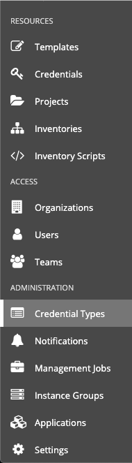
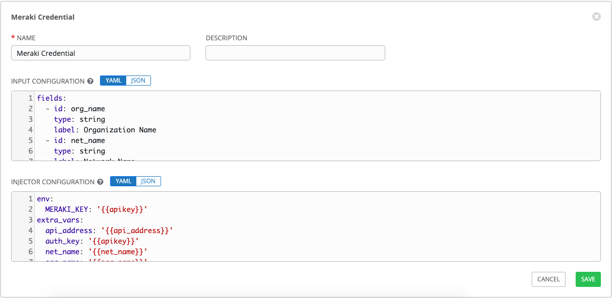
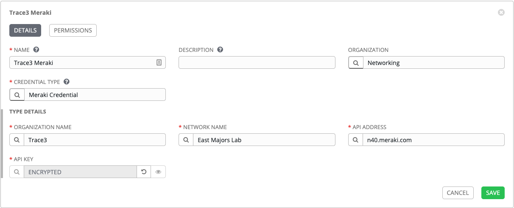

Configuring Ansible Tower
=========================

There are a number of constructs in the Ansible Tower UI that enable
multi-tenancy, notifications, scheduling, etc. However, we are only
going to focus on a few of the key constructs that are required for this
workshop today.

- Credential Types

- Credentials

Logging into Tower
==================

Your Ansible Tower instance url and credentials were supplied already

Your Ansible Tower license has already been applied, so after
logging in you should now see the Dashboard.

Creating a new Mearki Credential
=============================

Credentials are utilized by Tower for authentication when launching jobs
against machines, synchronizing with inventory sources, and importing
project content from a version control system. Some credentials are provided by default but you can also create your own.

In this workshop we are going to create a credential for the Meraki API.

Step 1:
-------

Select CREDENTIAL TYPES from the left hand panel under Administration



Step 2:
-------

Click the  icon and add new credential type

Step 3:
-------

Complete the form using the following entries:

| Key          | Value            |                                          |
|--------------|------------------|------------------------------------------|
| Name         | Meraki Credential|                                          |

INPUT Configuration
```
fields:
  - id: org_name
    type: string
    label: Organization Name
  - id: net_name
    type: string
    label: Network Name
  - id: api_address
    type: string
    label: API Address
  - id: apikey
    type: string
    label: API Key
    secret: true
required:
  - apikey
  - org_name
  - net_name
  - api_address
```
INJECTOR CONFIGURATION
```
env:
  MERAKI_KEY: '{{apikey}}'
extra_vars:
  api_address: '{{api_address}}'
  auth_key: '{{apikey}}'
  net_name: '{{net_name}}'
  org_name: '{{org_name}}'
```


Step 4:
-------

Select SAVE   

Create a Meraki Credential
========================

Now that we've created the credential type, we need to enter our credentials with the following details:

| Key              | Value                            |                                            |
|------------------|----------------------------------|--------------------------------------------|
| Name             | Meraki Credential                |                                            |
| Description      | Meraki credential for workshop   |                                            |
| Organization     | Default                          |                                            |
| Type             | Meraki Credential                |                                            |
| Organization Name| Aarons,Inc                       | Replace with your organization name        |
| Network Name     | C9991                            | Replace with your network name             |
| API Address      | n120.meraki.com                  | Replace with your api address              |
| API Key          | *******                          | Replace ******* with your api key          |

Select SAVE   



Inventories
===========

An inventory is a collection of hosts against which jobs may be
launched. Inventories are divided into groups and these groups contain
the actual hosts. Inventories may be sourced manually, by entering host
names into Tower, or from one of Ansible Tower’s supported cloud
providers. Meraki modules only requre a localhost
to contact the Meraki API so it has been created for you.

<br><br>

[Click here to return to the Ansible for Meraki Workshop](https://github.com/shadowman-lab/Ansible-Meraki/tree/master/exercises)
